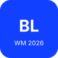
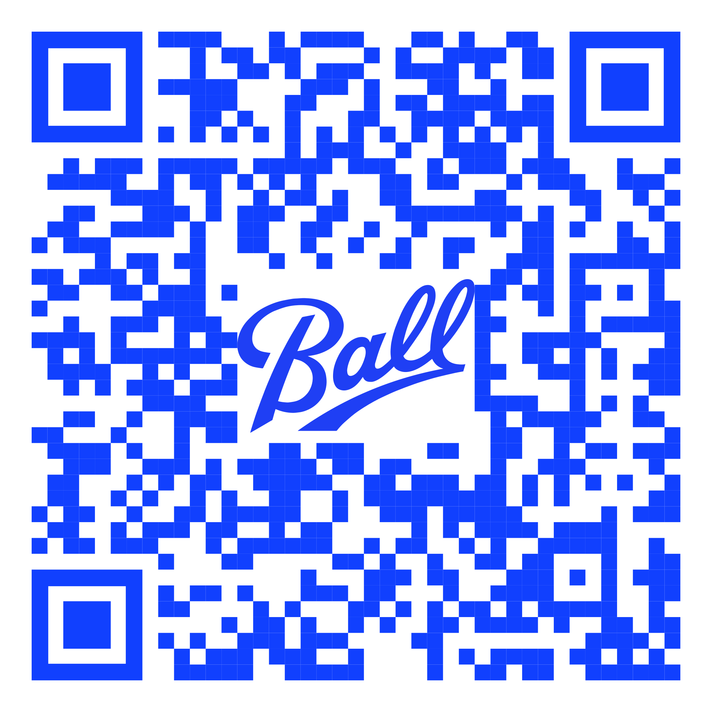

# Ball Ludesch · WM 2026 Kicktipp

Statische Website (2 Seiten) für das firmeninterne Kicktipp-Turnier zur WM 2026.

## Dateien

- `index.html` – Landing Page mit Kurz-Anleitung, QR-Code und wichtigsten Links
- `anleitung.html` – Detaillierte Schritt-für-Schritt-Anleitung inkl. Erklärung der Kicktipp-Bereiche
- `styles.css` – komplettes Styling (Inter, Hauptfarbe `#1140fe`, mobile-first)
- `assets/logo.svg` – **Platzhalter** für das Turnier-Logo
- `assets/qr-code.svg` – **Platzhalter** für den QR-Code zur Tipprunde
- `assets/favicon.svg` – Tab-Icon

## Logo & QR-Code ersetzen

Die finalen Grafiken einfach in `assets/` ablegen und – falls anderes Format als SVG –
in den HTML-Dateien die Endung anpassen:

```html
<!-- in index.html und anleitung.html -->
      → 
   → 
```

Bei gleichem Dateinamen mit `.svg` Endung müssen die HTML-Dateien nicht angepasst werden.

## Lokal anschauen

Einfach `index.html` im Browser öffnen, oder:

```bash
python3 -m http.server 8000
# dann http://localhost:8000 öffnen
```

## Hosting

Kann überall statisch gehostet werden: GitHub Pages, Netlify, Intranet-Webserver – alle
Pfade sind relativ und kommen ohne Build-Step aus.
